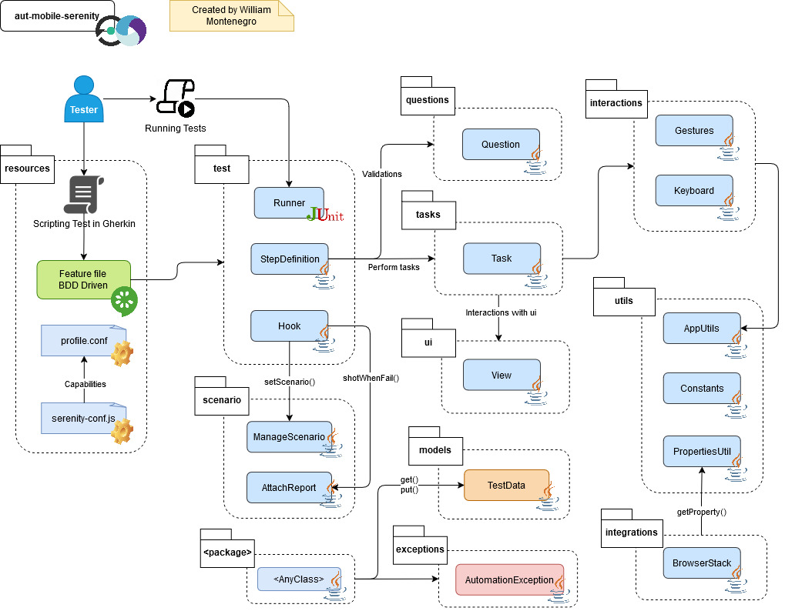

# Serenity-BDD Mobile Automation Framework

Framework de automatización de pruebas móviles utilizando Serenity-BDD con Screenplay.
Este proyecto está para facilitar la escritura de pruebas legibles y mantenibles.   
Además, soporta pruebas en la nube (BrowserStack/Saucelabs) y soporta dispositivos Android e iOS.

## 🚀 Características

- Automatización de pruebas móviles usando Serenity-BDD
- Estructura basada en Screenplay
- Integración con Cucumber y lenguaje Gherkin
- Soporte para ejecución local y en la nube
- Manejo de logs y reportes automáticos
- Ejecución con Gradle y JUnit

## 🛠️ Tecnologías Utilizadas

- **Lenguaje de programación**: Java
- **Frameworks de automatización**:
    - [Serenity BDD](https://serenity-bdd.github.io/)
    - [Cucumber](https://cucumber.io/)
    - [JUnit](https://junit.org/)
- **Herramientas adicionales**:
    - [Gradle](https://gradle.org/)
    - [BrowserStack](https://www.browserstack.com/)
    - [Saucelabs](https://saucelabs.com/)

## 📂 Arquitectura del Proyecto



## 📋 Instalación

### Clonar el Repositorio

```
git clone https://github.com/wpmontenegro/aut-mobile-serenity.git
cd aut-mobile-serenity
```

### Instalación de Dependencias

```
mvn clean install -DskipTests
```

## ▶️ Ejecución de pruebas

### Prerrequisitos

- Appium Server (para pruebas locales)
- Cuenta en BrowserStack/Saucelabs (para pruebas en la nube)
- Descargar [**MyDemoApp**](https://github.com/saucelabs/my-demo-app-rn/releases/)

### Pruebas locales

1. Iniciar el servidor de Appium en el terminal: ```appium```
2. Descarga la app y ubíquela en la ruta `src/test/resources/app/` con el nombre `MyRNDemoApp`
3. Ejecutar las pruebas:
```
mvn clean test -Dplatform={PLATFORM} -Dtype={TYPE}
```

### Pruebas en la nube

1. Sube la aplicación a **BrowserStack/SauceLabs** y elige el tipo de driver `bstack` or `sauce`
2. Establezca las **Credenciales de BrowserStack/SauceLabs** como variables de entorno:
```
export {BROWSERSTACK_USER/SAUCE_USER}=tu_usuario
export {BROWSERSTACK_KEY/SAUCE_KEY}=tu_clave
```
3. Suba el aplicativo a BrowserStack/SauceLabs y establezcalo en el archivo de configuración correspondiente
```
src/test/resources/profiles/bstack -> Para Browserstack
src/test/resources/profiles/sauce -> Para Saucelabs
```
4. Ejecutar las pruebas:
```
mvn clean test -Dplatform={PLATFORM} -Dtype={TYPE}
```

## 🔧 Configuración

### Parámetros

`platform` (requerido):

Establece la plataforma en la que se ejecutarán las pruebas. Valores permitidos:

```
android (para dispositivos Android)
ios (para dispositivos  iOS)
```

`type` (requerido):

Define el tipo de driver. Valores permitidos:

```
local (para ejecutar pruebas en local con emulador o dispositivo físico)
bstack (para ejecutar pruebas en la nube usando BrowserStack)
sauce (para ejecutar pruebas en la nube usando SauceLabs)
```

### Serenity Config

Este proyecto utiliza `.serenity.conf` para gestionar la ejecución en diferentes perfiles o dispositivos.
El archivo se encuentran en:

```
src/test/resources/
├── serenity.conf  # Configuraciones generales para ejecución con diferentes perfiles
```

Cada perfil se debe configurar dentro de la carpeta `src/test/resources/profiles`, pudiendo configurar la ejecución en local y la nube.

## 📊 Reportes de Pruebas

Los reportes de las ejecuciones se generan automáticamente en formato HTML y se almacenan en la carpeta `target/site/serenity`.
Para visualizar un reporte:

```
open target/site/serenity/index.html
```

## 📬 Contacto

Para preguntas o sugerencias, puedes contactarme a través de:

- Correo electrónico: wmontenegro@outlook.com.pe
- LinkedIn: [**wmontenegro**](https://www.linkedin.com/in/wmontenegro)
- GitHub: [**wpmontenegro**](https://github.com/wpmontenegro)